# 🛡️ SentinelRAG

<div align="center">

**A High-Performance, Privacy-First, Local Hybrid RAG Engine for Obsidian Markdown Vaults**

[](https://www.python.org/)
[](#)
[](https://ollama.com/)
[](LICENSE)

</div>

---

## 📖 Table of Contents
- [🛡️ SentinelRAG](#️-sentinelrag)
  - [📖 Table of Contents](#-table-of-contents)
  - [💡 Introduction](#-introduction)
  - [🎯 Architecture Overview](#-architecture-overview)
  - [✨ Features](#-features)
  - [🚀 Installation](#-installation)
    - [Option A: Global CLI Install via `pipx` (Recommended)](#option-a-global-cli-install-via-pipx-recommended)
    - [Option B: Global CLI Install via standard `pip`](#option-b-global-cli-install-via-standard-pip)
    - [Option C: Local Development with `uv`](#option-c-local-development-with-uv)
  - [🎬 Basic Usage Flow](#-basic-usage-flow)
  - [💻 Command Reference](#-command-reference)
    - [1. `profile`](#1-profile)
    - [2. `setup-ollama`](#2-setup-ollama)
    - [3. `ingest`](#3-ingest)
    - [4. `ask`](#4-ask)
    - [5. `doctor`](#5-doctor)
    - [6. `serve`](#6-serve)
  - [🔌 API Integration & Obsidian Connection](#-api-integration--obsidian-connection)
    - [Authentication](#authentication)
    - [Endpoints](#endpoints)
  - [💾 Storage Schema \& Internals](#-storage-schema--internals)
    - [1. SQLite Relational Store (`sentinelrag.db`)](#1-sqlite-relational-store-sentinelragdb)
    - [2. Qdrant Vector Store (`/qdrant/`)](#2-qdrant-vector-store-qdrant)
  - [🧪 Testing](#-testing)
  - [📄 License](#-license)

---

## 💡 Introduction

**SentinelRAG** is a production-grade, local-first Retrieval-Augmented Generation (RAG) system engineered to turn your local **Obsidian Markdown Vault** into a private, highly-contextualized query engine. 

Operating with absolute privacy (zero telemetry or cloud leaks), SentinelRAG employs a **hybrid retrieval strategy** combining semantic vector matching (Qdrant Local) with graph-theoretic structural analysis (SQLite Graph Store). It dynamically adjusts its reasoning workload using **hardware-adaptive LangGraph topologies** to ensure optimal performance, whether running on a low-end laptop or a multi-GPU workstation.

---

## 🎯 Architecture Overview

```mermaid
graph TD
    %% Ingestion Pipeline
    subgraph Ingestion ["1. INGESTION PIPELINE"]
        Vault[Obsidian Vault] --> Watcher[VaultWatcher / Watchdog]
        Watcher -->|Debounced Event| Parser[3-Tier Parser]
        Parser -->|Blocks, Links, Tags| GraphStore[SQLite Graph Store]
        Parser -->|Text Chunks| VecStore[Qdrant Local Disk]
    end

    %% Query Reasoning Pipeline
    subgraph QueryPipeline ["2. HYBRID QUERY ENGINE"]
        UserQ[User Question] --> Classifier[Query Classifier]
        
        Classifier -->|Semantic Query| QdrantSearch[Qdrant Vector Search]
        Classifier -->|Structural/Graph Query| SQLiteGraph[SQLite Graph Centrality]
        
        QdrantSearch -->|Vector Hits| Merger[Evidence Merger / RRF Blending]
        SQLiteGraph -->|Graph Hits| Merger
        
        Merger -->|Citations & Blended Evidence| LangGraph[Tier-Adaptive LangGraph Agent]
        LangGraph -->|Ollama Local Inference| Output[Grounded Cited Answer]
    end
```



---

## ✨ Features

* 📁 **Deep Obsidian Integration**: Specially designed to parse Wikilinks (`[[NoteName]]`), tags (`#tag`), structural headers (`#` to `######`), list structures, and code fences block-by-block.
* ⚡ **Zero-Dependency Core**: Installs as a lightweight Python package with zero Docker container requirements or heavy external database setups.
* 🧬 **Tier-Adaptive Topologies (LangGraph)**:
  * **Tier A (High-End GPU)**: Activates full Planner, Retriever, Merger, separate Validator and Critic, and Synthesizer nodes.
  * **Tier B (Mid-Range)**: Coalesces Validator/Critic nodes into a combined pass to conserve memory.
  * **Tier C (Low-End/CPU)**: Streamlines execution into a linear Retriever -> Merger -> Synthesizer pipe.
* 🔄 **Debounced Real-Time Watcher**: Incremental file updates, renames, deletions, and creations are automatically processed with a thread-safe 500ms debouncing watchdog handler.
* 🔀 **RRF Blended Retrieval**: Fuses vector similarities with document-level eigenvector centrality scores (incorporating page decay) using **Reciprocal Rank Fusion (RRF)**.
* 🛡️ **Extractive Fallback**: If the local Ollama instance is offline or unreachable, the system automatically runs in a cited extractive fallback mode, supplying direct source passages to guarantee continuity.

---

## 🚀 Installation

Ensure you have Python `>=3.12` installed.

### Option A: Global CLI Install via `pipx` (Recommended)
This installs SentinelRAG globally in an isolated environment so you can run it from any directory on your device:

```bash
# 1. Install pipx and update system PATH
pip install pipx
pipx ensurepath

# 2. Install SentinelRAG globally from your local clone
pipx install C:/Users/codex/GitHub/RAG
```

### Option B: Global CLI Install via standard `pip`
To install for your current user profile:

```bash
# 1. Install globally in editable mode
pip install --user -e C:/Users/codex/GitHub/RAG
```

If the command is not recognized, add the Python scripts directory to your system `PATH`:
- **Windows PowerShell**:
  ```powershell
  [Environment]::SetEnvironmentVariable("Path", $env:Path + ";$env:APPDATA\Python\Python314\Scripts", "User")
  ```
  *(Note: Adjust `Python314` to your installed Python version if necessary.)*

### Option C: Local Development with `uv`
```bash
git clone https://github.com/CODExGAMERZ/SentinelRAG.git
cd SentinelRAG
uv pip install -e .
```

---

## 🎬 Basic Usage Flow

Once installed, you can call the command from any folder:

```bash
# 1. Profile hardware and generate default configuration
sentinelrag profile

# 2. Setup Ollama (downloads client if missing and pulls model)
sentinelrag setup-ollama --install --pull-model

# 3. Ingest your vault directory (e.g. storage_vault)
sentinelrag ingest storage_vault --reset

# 4. Ask a question
sentinelrag ask "What is Qwen3?"
```

---

## 💻 Command Reference

All commands can be executed using `uv run sentinelrag <command>` or directly via the globally installed `sentinelrag <command>` CLI entrypoint.

### 1. `profile`
Profiles your local system resources (CPU, RAM, GPU) and sets optimal configuration parameters.
* **Usage**: `sentinelrag profile [options]`
* **Options**:
  * `--json`: Print machine-readable JSON output instead of plain text.

---

### 2. `setup-ollama`
Checks local Ollama server connectivity, installs it if missing, and downloads the recommended model.
* **Usage**: `sentinelrag setup-ollama [options]`
* **Options**:
  * `--install`: Automatically install the Ollama runner if it is not detected on your system.
  * `--pull-model`: Automatically pull the recommended local model (e.g. `qwen2.5:3b`) from the Ollama registry.
  * `--model <name>`: Override the recommended Ollama model and specify a custom model to download/configure.
  * `--json`: Print machine-readable configuration JSON.

---

### 3. `ingest`
Parses and indexes an Obsidian vault directory into your local databases.
* **Usage**: `sentinelrag ingest <path> [options]`
* **Arguments**:
  * `<path>`: The absolute or relative path to the Obsidian Markdown Vault folder.
* **Options**:
  * `--reset`: Drop all existing points in the vector store and clean SQLite tables before starting ingestion.
  * `--force`: Force a full re-indexing of all vault files, bypassing the timestamp/mtime change checks.
  * `--collection <name>`: Ingest files into a named vector and graph collection namespace (defaults to `default`).
  * `--watch`: Start a persistent background filesystem watcher to track vault saves, updates, deletions, and renames in real-time.

---

### 4. `ask`
Performs queries against your local collection using the hybrid retrieval and agent synthesis engine.
* **Usage**: `sentinelrag ask <question> [options]`
* **Arguments**:
  * `<question>`: The question query to answer.
* **Options**:
  * `--collection <name>`: Specify which collection namespace to query (defaults to `default`).
  * `--top-k <num>`: Override the configured number of vector chunks to retrieve for context synthesis.
  * `--json`: Print machine-readable JSON containing the answer, duration, model, and detailed citations.

---

### 5. `doctor`
Performs system health checks, validating libraries, database sizes, Ollama connection, and active configuration paths.
* **Usage**: `sentinelrag doctor [options]`
* **Options**:
  * `--json`: Print diagnostics report in machine-readable JSON.

---

### 6. `serve`
Runs the authenticated local API server to connect external client interfaces to your SentinelRAG engine.
* **Usage**: `sentinelrag serve [options]`
* **Options**:
  * `--port <num>`: Specify a custom port to run the API daemon (defaults to the configured port).
  * `--persist-token`: Save the generated or specified API authorization token to disk.

---

## 🔌 API Integration & Obsidian Connection

SentinelRAG includes an embedded authenticated web server that lets you connect third-party user interfaces (like Obsidian plugins, local websites, or desktop widgets) directly to your indexed knowledge base.

To spin up the local server, run:
```bash
sentinelrag serve --port 8000
```
At startup, the server will print a **Bearer Token** to the console. You must include this token in the `Authorization` header of all requests.

### Authentication
Include the following header with your requests:
```http
Authorization: Bearer <YOUR_API_TOKEN>
```

### Endpoints
* **`POST /api/query`**: Queries the SentinelRAG engine.
  * **Payload**:
    ```json
    {
      "question": "What is Qwen3?",
      "collection": "default",
      "top_k": 8
    }
    ```
  * **Response**: Returns the answer, metadata, and complete cited context sources.

* **`POST /api/ingest`**: Triggers a synchronization run of a local directory folder.
  * **Payload**:
    ```json
    {
      "path": "C:/Users/codex/GitHub/RAG/storage_vault",
      "reset": false,
      "force": false
    }
    ```

---

## 💾 Storage Schema & Internals

All persistent files are located in:
* **Windows**: `%LOCALAPPDATA%\SentinelRAG` (e.g., `C:\Users\<Name>\AppData\Local\SentinelRAG`)
* **macOS/Linux**: `~/.sentinelrag`

### 1. SQLite Relational Store (`sentinelrag.db`)
Maintains structural relations, metadata, and extracted entities.
* `nodes`: Vault note path, title, modification time (`mtime`), and evergreen flags.
* `blocks`: Individual parsed content blocks, content hashes, header context, and tags.
* `edges`: Directed linkages between files (`source` to `target`) representing Wikilinks.
* `triples`: Extracted Subject-Predicate-Object (SPO) relationships representing semantic associations.

### 2. Qdrant Vector Store (`/qdrant/`)
Contains localized Qdrant databases for high-speed dense vector matching.
* Points are identified deterministically using `uuid.uuid5` generated from block-level IDs to ensure idempotent updates.

---

## 🧪 Testing

To run the complete test suite (containing 20 unit and stress tests covering watchers, link disambiguation, RRF blending, and lock contention):

```bash
uv run pytest
```

---

## 📄 License

This project is licensed under the MIT License - see the [LICENSE](LICENSE) file for details.
