# 🛡️ SentinelRAG

<div align="center">

**A High-Performance, Privacy-First, Local-First Hybrid RAG Engine for Obsidian Markdown Vaults**

[](https://www.python.org/)
[](#)
[](https://ollama.com/)
[](LICENSE)

</div>

---

## 📖 Introduction

**SentinelRAG** is a production-grade, local-first Retrieval-Augmented Generation (RAG) system engineered to turn your local **Obsidian Markdown Vault** into a private, highly-contextualized knowledge base. 

Operating with absolute privacy (zero telemetry or cloud leaks), SentinelRAG employs a **hybrid retrieval strategy** combining semantic vector matching (Qdrant Local) with graph-theoretic structural analysis (SQLite Graph Store). It dynamically adjusts its reasoning workload using **hardware-adaptive LangGraph topologies** to ensure optimal performance, whether running on a low-end laptop or a multi-GPU workstation.

---

## 🎯 Architecture Overview

```mermaid
graph TD
    %% Ingestion Pipeline
    subgraph Ingestion ["1. INGESTION PIPELINE"]
        Vault[Obsidian Vault] --> Watcher[VaultWatcher / Watchdog]
        Watcher -->|Debounced Event| Parser[3-Tier Parser]
        Parser -->|Blocks, Links, Tags| GraphStore[SQLite Graph Store]
        Parser -->|Text Chunks| VecStore[Qdrant Local Disk]
    end

    %% Query Reasoning Pipeline
    subgraph QueryPipeline ["2. HYBRID QUERY ENGINE"]
        UserQ[User Question] --> Classifier[Query Classifier]
        
        Classifier -->|Semantic Query| QdrantSearch[Qdrant Vector Search]
        Classifier -->|Structural/Graph Query| SQLiteGraph[SQLite Graph Centrality]
        
        QdrantSearch -->|Vector Hits| Merger[Evidence Merger / RRF Blending]
        SQLiteGraph -->|Graph Hits| Merger
        
        Merger -->|Citations & Blended Evidence| LangGraph[Tier-Adaptive LangGraph Agent]
        LangGraph -->|Ollama Local Inference| Output[Grounded Cited Answer]
    end
```



---

## ✨ Features

* 📁 **Deep Obsidian Integration**: Specially designed to parse Wikilinks (`[[NoteName]]`), tags (`#tag`), structural headers (`#` to `######`), list structures, and code fences block-by-block.
* ⚡ **Zero-Dependency Core**: Installs as a lightweight Python package with zero Docker container requirements or heavy external database setups.
* 🧬 **Tier-Adaptive Topologies (LangGraph)**:
  * **Tier A (High-End GPU)**: Activates full Planner, Retriever, Merger, separate Validator and Critic, and Synthesizer nodes.
  * **Tier B (Mid-Range)**: Coalesces Validator/Critic nodes into a combined pass to conserve memory.
  * **Tier C (Low-End/CPU)**: Streamlines execution into a linear Retriever -> Merger -> Synthesizer pipe.
* 🔄 **Debounced Real-Time Watcher**: Incremental file updates, renames, deletions, and creations are automatically processed with a thread-safe 500ms debouncing watchdog handler.
* 🔀 **RRF Blended Retrieval**: Fuses vector similarities with document-level eigenvector centrality scores (incorporating page decay) using **Reciprocal Rank Fusion (RRF)**.
* 🛡️ **Extractive Fallback**: If the local Ollama instance is offline or unreachable, the system automatically runs in a cited extractive fallback mode, supplying direct source passages to guarantee continuity.

---

## 🚀 Installation & Quick Start

### 1. Prerequisites
- Python `>=3.12` (Tested up to Python 3.14)
- **Ollama** installed locally (Optional, but required for generative synthesis)

### 2. Installation
Clone the repository and install using `uv` (recommended) or `pip`:

```bash
git clone https://github.com/CODExGAMERZ/SentinelRAG.git
cd SentinelRAG
uv pip install -e .
```

### 3. Basic Usage Flow
Initialize settings, ingest your Markdown vault, and run a query:

```bash
# 1. Profile hardware and generate default configuration
uv run sentinelrag profile

# 2. Setup Ollama (downloads client if missing and pulls model)
uv run sentinelrag setup-ollama --install --pull-model

# 3. Ingest your vault directory (e.g. storage_vault)
uv run sentinelrag ingest storage_vault --reset

# 4. Ask a question
uv run sentinelrag ask "What is Qwen3?"
```

---

## 💻 Command Reference

### `profile`
Profiles CPU cores, RAM, and GPU capacity to write hardware-adaptive configurations.
```bash
uv run sentinelrag profile --json
```

### `setup-ollama`
Checks for, installs, and configures Ollama connections.
```bash
# Automatically install Ollama and pull the recommended model
uv run sentinelrag setup-ollama --install --pull-model
```

### `ingest`
Indexes a local directory containing Markdown files.
```bash
# Ingest with incremental watch mode enabled
uv run sentinelrag ingest path/to/vault --watch

# Force rebuild/re-indexing of all files (ignoring modification times)
uv run sentinelrag ingest path/to/vault --force
```

### `ask`
Performs queries against your local collection.
```bash
# Query the default namespace collection and print citations
uv run sentinelrag ask "What is SentinelRAG?"

# Return structured JSON output for API integrations
uv run sentinelrag ask "What is SentinelRAG?" --json --top-k 5
```

### `doctor`
Displays diagnostic outputs for all parts of the system.
```bash
uv run sentinelrag doctor
```

---

## 💾 Storage Schema & Internals

All persistent files are located in:
* **Windows**: `%LOCALAPPDATA%\SentinelRAG` (e.g., `C:\Users\<Name>\AppData\Local\SentinelRAG`)
* **macOS/Linux**: `~/.sentinelrag`

### 1. SQLite Relational Store (`sentinelrag.db`)
Maintains structural relations, metadata, and extracted entities.
* `nodes`: Vault note path, title, modification time (`mtime`), and evergreen flags.
* `blocks`: Individual parsed content blocks, content hashes, header context, and tags.
* `edges`: Directed linkages between files (`source` to `target`) representing Wikilinks.
* `triples`: Extracted Subject-Predicate-Object (SPO) relationships representing semantic associations.

### 2. Qdrant Vector Store (`/qdrant/`)
Contains localized Qdrant databases for high-speed dense vector matching.
* Points are identified deterministically using `uuid.uuid5` generated from block-level IDs to ensure idempotent updates.

---

## 🧪 Testing

To run the complete test suite (containing 20 unit and stress tests covering watchers, link disambiguation, RRF blending, and lock contention):

```bash
uv run pytest
```

---

## 📄 License

This project is licensed under the MIT License - see the [LICENSE](LICENSE) file for details.
