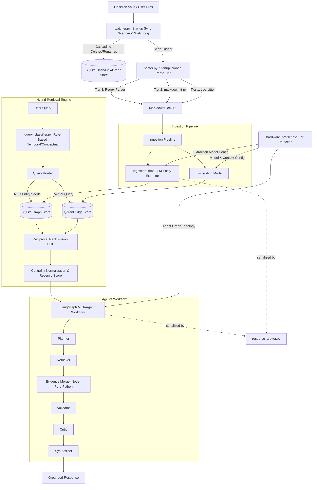

# SentinelRAG — Master Implementation Plan

This master plan establishes the complete architecture and verification plan for **SentinelRAG**, a hardware-adaptive, local-first agentic RAG platform. It integrates **Obsidian Markdown Vaults**, uses **Tree-sitter** for syntax-aware structural parsing, stores data natively in **Qdrant Edge** and **SQLite**, and orchestrates reasoning using **LangGraph** with a dedicated Evidence Merger agent. The agent graph topology and model selection are both driven by a hardware profiler so the same codebase scales from CPU-only laptops to multi-GPU workstations.



---

## 🛠️ Core System Architecture

### 1. Hardware Profiling & Adaptive Model/Topology Selection (`hardware_profiler.py`)

To run on consumer hardware without OOM crashes, and to keep query latency reasonable on low-end machines, the profiler drives **both** model selection and agent graph shape.

#### System & GPU Diagnostics (cross-platform)
GPU detection is platform-specific — there is no single API that covers all vendors:
- **NVIDIA**: `pynvml` for VRAM, utilization, and compute capability.
- **Apple Silicon**: detected via `platform.machine() == "arm64"` on macOS, with unified memory size read through `sysctl` (no discrete VRAM to query — CPU/GPU share system RAM).
- **AMD**: `rocm-smi` if present on the system path; otherwise treated as CPU-only.
- **No GPU detected**: falls back to CPU-only tier using system RAM and core count.

#### Hardware Tiers
| Tier | Profile | Example |
|---|---|---|
| **A — High** | Dedicated GPU ≥12GB VRAM, or Apple Silicon ≥32GB unified memory | RTX 4080+, M2/M3 Max |
| **B — Mid** | Dedicated/integrated GPU 6–12GB, or 16–32GB unified/system RAM | RTX 3060, M1/M2 base |
| **C — Low** | CPU-only or iGPU, <16GB RAM | Budget laptops, older hardware |

#### Dynamic Parameters
- Sets `num_ctx` (context window) and `OLLAMA_NUM_PARALLEL` based on free memory at startup.
- Quantization routing: `GGUF` for CPU-only/Apple Silicon, `AWQ`/`GPTQ`/`GGUF` for dedicated GPU.

#### Agent Graph Topology by Tier
A fixed 4-LLM-call chain (Planner → Validator → Critic → Synthesizer) is too heavy for Tier C hardware. The profiler selects the workflow shape at startup:

| Tier | Agent Chain |
|---|---|
| **A** | Planner → Retriever → Evidence Merger → Validator → Critic → Synthesizer (full chain) |
| **B** | Planner → Retriever → Evidence Merger → Validator+Critic (combined single call) → Synthesizer |
| **C** | Retriever → Evidence Merger → Synthesizer (single-pass, no planning/critique loop) |

#### Resource Arbitration (`resource_arbiter.py`)
On Tier B/C, ingestion-time entity extraction (background watcher) and query-time agent calls compete for the same limited RAM/VRAM. A lightweight mutex/queue serializes LLM invocations so a background reindex never collides with an active query:
- **Tier A**: ingestion and query LLM calls run concurrently (sufficient headroom).
- **Tier B/C**: ingestion extraction yields to any in-flight query; queued extraction jobs resume once the query completes.

---

### 2. Robust Markdown Parsing & Common Intermediate Representation (IR)

#### Startup Parser Probing
The parser checks library compilation capability **once at startup** and locks the environment into a single parsing tier for the life of the process, ensuring vault-wide structural consistency:
- **Tier 1 — `tree-sitter-markdown`**: precise structural block boundaries when compilers are present.
- **Tier 2 — `markdown-it-py`**: pure-Python fallback, no compiler required.
- **Tier 3 — Regex Structural Parser**: zero-dependency safety net.

#### Common Intermediate Representation (IR)
All tiers normalize into a single `MarkdownBlockIR`. Block identity is **content- and structure-derived**, not based on file path or positional index — this is what makes block-level incremental indexing actually work:

```python
@dataclass(slots=True)
class MarkdownBlockIR:
    block_id: str              # Stable identity hash: header_path + block_type + content fingerprint
                                # (first 64 chars of content). Deliberately excludes source_path and
                                # global position, so it survives both renames and insertions/deletions
                                # elsewhere in the file.
    content_hash: str          # SHA-256 of the full `content` — used to detect actual edits
    source_path: str           # Relative note path (e.g., "Research/Qwen.md") — stored as a separate
                                # DB column, not baked into block_id
    block_type: str            # "heading", "paragraph", "code_block", "list_item"
    content: str                # Raw text content within the block
    headers: list[str]         # Structural path (e.g., ["Qwen3", "Performance"])
    tags: list[str]            # Extracted tags (e.g., ["#llm", "#benchmark"])
    links: list[str]           # Extracted target Wikilinks (e.g., ["Gemma3"])
    created_at: float | None
    updated_at: float | None
```

**Storage key**: `(source_path, block_id)` composite, not `block_id` alone. This decouples identity from location.

**Known limitation**: because the content fingerprint covers only the first 64 characters, a large rewrite at the start of a block is treated as delete-old/insert-new rather than an in-place edit. This is an accepted trade-off — correctness (no stale embeddings) over perfect diff tracking.

---

### 3. In-Process Storage Tier & Incremental Syncing

#### In-Process DB Managers (`db_manager.py`)
- **Vector storage**: `QdrantClient` in local disk mode (`QdrantClient(path="./data/qdrant_db")`), no Docker dependency.
- **Knowledge graph**: a single, native `SQLiteGraphStore` for v1. (A Redis/FalkorDB-backed alternative was considered but deferred — see *Future Considerations*.)

#### Synchronization & Hashing (`watcher.py`)
- **Startup Sync**: a delta scan on launch compares vault `mtime` against SQLite records; unchanged files are skipped without parsing.
- **Block-Level Hashing**: blocks are matched between the previous and current parse by `block_id`. A `block_id` with no prior match = insertion. A prior `block_id` absent from the new parse = deletion. A matched `block_id` with a different `content_hash` = edit, triggering re-embedding of only that block.
- **Debounced Watching**: a background `watchdog` thread uses a thread-safe `500ms` debounce window to coalesce rapid editor save events into a single reindex pass.
- **Cascading Deletes**: deleting a file removes its rows from SQLite (links/edges) and Qdrant Edge (vectors), and flags any other notes whose Wikilinks now point to nothing.
- **Renames**: because `block_id` excludes `source_path`, a rename is a single `UPDATE` of the `source_path` column across that file's rows — `block_id` values are untouched, no re-embedding is triggered, and block-level hash history survives the rename intact.
- **ACID Persistence**: block hashes, note links, and graph relationships live in the unified SQLite store (no standalone JSON files).

---

### 4. Dual-Stage Entity Extraction

To keep query latency low, extraction is split by when it runs:

- **Ingestion Time (LLM-based)**: a local LLM extracts entity-relation-entity triples (e.g., `Qwen3 8B` → `outperformed` → `Gemma3 4B`) once per changed block, fully amortized into the background indexing pass. Runs with **temperature=0 / deterministic decoding** so re-extraction of unchanged content (e.g., triggered by an unrelated rename) produces identical triples rather than causing graph drift.
- **Retrieval Time (rule-based NER)**: a fast regex/keyword scanner extracts seed entities from the user query — no LLM call — used to seed graph traversal immediately.

---

### 5. Hybrid Retrieval Scoring & Normalization

#### Rule-Based Query Classification (`query_classifier.py`)
Before retrieval, the query is classified as **conceptual** ("what is transformer architecture") or **temporal/procedural** ("what changed on Project X this week") using keyword/pattern matching (date references, words like "today," "recent," "latest," "updated") — deliberately **not** an LLM call, to avoid adding a model round-trip to every query's critical path. This classification gates whether temporal decay applies during scoring.

#### RRF Candidate Fusion
Candidates are retrieved **independently** from Qdrant Edge (vector similarity) and graph traversal (neighbor nodes from query entity seeds), then merged with Reciprocal Rank Fusion before scoring — preventing structurally relevant but low-similarity notes from being excluded by a vector-only shortlist:

\[
RRF\_Score(d) = \sum_{m \in M} \frac{1}{60 + Rank_m(d)}
\]

#### Multi-Factor Blending
\[
\text{Final Score} = 0.60 \times \text{Semantic Similarity} + 0.30 \times \text{Normalized Centrality} + 0.10 \times \text{Temporal Relevance}
\]
- **Centrality Normalization**: raw degree/PageRank centrality is unbounded and hub-skewed; Min-Max normalized within the candidate set before blending.
- **Centrality Caching**: centrality is **not** recomputed per query. It's cached in SQLite and recomputed incrementally on a dirty-flag basis, debounced to run at most every N seconds (or after M graph mutations) — avoiding full-graph recomputation thrashing during active editing sessions.

#### Configurable Temporal Decay
- FLEETING/JOURNAL notes: \( e^{-\text{days\_old}/90} \).
- REFERENCE/EVERGREEN notes (`#evergreen`, `#reference` tags): decay skipped, weight fixed at `1.0`.
- Decay is only applied when `query_classifier.py` labels the query as temporal/procedural; conceptual queries ignore recency entirely.
- **Fallback**: filesystem `mtime` used when frontmatter date keys are absent.

---

### 6. Knowledge Graph Module (`src/sentinelrag/graph/`)

- **`graph_store.py`**: generic node/edge wrapper over the SQLite graph tables (insert, query, delete).
- **`link_resolver.py`**: resolves Obsidian Wikilinks `[[Note Name#Header|Alias]]` to file coordinates, with an explicit disambiguation policy for duplicate titles:
  1. Exact path match if the Wikilink includes a folder (e.g., `[[Research/Qwen]]`).
  2. Prefer a note in the same folder as the linking note.
  3. Otherwise, prefer the most recently modified candidate.
  4. If still ambiguous, resolve to **all** candidates and set `ambiguous_link: true` in provenance, so the Synthesizer can surface the ambiguity rather than silently picking one.
- **`traversal.py`**: multi-hop pathfinding over the graph, used by the RRF candidate fan-out to find neighbor notes from query entity seeds.
- **`entity_graph.py`**: stores and queries the subject-predicate-object triples produced by ingestion-time extraction — kept separate from `graph_store.py`'s generic node/edge wrapper since triples have their own schema (subject, predicate, object, source_block_id, confidence).
- **`ranking.py`**: computes and caches normalized centrality scores (see caching note above) and recency decay.

---

### 7. Evidence Merger Agent Node (`evidence_merger.py`)

A pure-Python (no LLM call, ~0ms overhead) LangGraph node that consolidates retrieved candidates into a strict schema. Score components are kept separate so downstream nodes (and the final response) can show *why* something was retrieved, and `source_type` reflects actual retrieval origin rather than conflating it with a scoring dimension:

```python
@dataclass(slots=True)
class MergedEvidence:
    content: str
    source_type: str          # "vector" | "graph" | "hybrid"
                               # ("hybrid" = surfaced by both vector search and graph traversal
                               #  during RRF fusion)
    source_id: str            # Note filepath
    semantic_score: float | None
    centrality_score: float | None
    recency_score: float
    final_score: float        # normalized weighted blend
    provenance: dict          # heading hierarchy, tags, Wikilink relationships, ambiguous_link flag
```

The Validator, Critic, and Synthesizer nodes operate exclusively on lists of `MergedEvidence`, keeping raw retrieval logic isolated from reasoning logic.

---

### 8. Secure Local HTTP API Daemon (`api.py`)

- Binds to `127.0.0.1` (localhost-only) by default.
- Every request requires a **Bearer API Token**, generated on first run and stored at `~/.sentinelrag/credentials` with `0600` permissions (owner read/write only). The token is regenerated each run unless a `--persist-token` flag is set, so a stable token is opt-in rather than default.
- Unauthorized requests are rejected with `401 Unauthorized`.
- Intended consumer: the Obsidian Community Plugin, sending queries from the note sidebar to the local daemon.

---

## Future Considerations (explicitly out of scope for v1)

- **FalkorDB/Redis-backed graph store**: an alternative to `SQLiteGraphStore` for WSL2/Redis environments was considered, but deferred. Maintaining two graph backends would require a shared interface contract and backend-equivalence tests for every traversal/ranking operation, which isn't justified until the SQLite path is proven in production.
- **Obsidian Community Plugin UI**: the local HTTP API is designed to support it, but the plugin itself ships separately.

---

## Proposed Files

### [Component: Configuration & Hardware]
- [NEW] [hardware_profiler.py](file:///c:/Users/codex/GitHub/RAG/src/sentinelrag/hardware_profiler.py) — Cross-platform GPU/CPU detection, tier classification, agent topology selection.
- [NEW] [resource_arbiter.py](file:///c:/Users/codex/GitHub/RAG/src/sentinelrag/resource_arbiter.py) — Serializes ingestion vs. query-time LLM calls on Tier B/C hardware.
- [MODIFY] [config.py](file:///c:/Users/codex/GitHub/RAG/src/sentinelrag/config.py) — Adds watchdog, SQLite graph, and hardware-tier configuration variables.

### [Component: Parser & File Watcher]
- [NEW] [parser.py](file:///c:/Users/codex/GitHub/RAG/src/sentinelrag/obsidian/parser.py) — 3-tier parsing and `MarkdownBlockIR` construction.
- [NEW] [watcher.py](file:///c:/Users/codex/GitHub/RAG/src/sentinelrag/obsidian/watcher.py) — Debouncer, startup sync, block-identity matching, rename/delete cascades.

### [Component: Knowledge Graph & Scoring]
- [NEW] [graph_store.py](file:///c:/Users/codex/GitHub/RAG/src/sentinelrag/graph/graph_store.py) — SQLite node/edge wrapper.
- [NEW] [link_resolver.py](file:///c:/Users/codex/GitHub/RAG/src/sentinelrag/graph/link_resolver.py) — Wikilink resolution with disambiguation policy.
- [NEW] [traversal.py](file:///c:/Users/codex/GitHub/RAG/src/sentinelrag/graph/traversal.py) — Multi-hop pathfinding for candidate fan-out.
- [NEW] [entity_graph.py](file:///c:/Users/codex/GitHub/RAG/src/sentinelrag/graph/entity_graph.py) — SPO triple storage and querying.
- [NEW] [ranking.py](file:///c:/Users/codex/GitHub/RAG/src/sentinelrag/graph/ranking.py) — Cached centrality computation and recency decay.

### [Component: Retrieval]
- [NEW] [query_classifier.py](file:///c:/Users/codex/GitHub/RAG/src/sentinelrag/retrieval/query_classifier.py) — Rule-based conceptual vs. temporal/procedural query classification.

### [Component: LangGraph Agents]
- [NEW] [evidence_merger.py](file:///c:/Users/codex/GitHub/RAG/src/sentinelrag/agents/evidence_merger.py) — Combines candidates into `MergedEvidence` schema.
- [NEW] [workflow.py](file:///c:/Users/codex/GitHub/RAG/src/sentinelrag/agents/workflow.py) — Assembles the LangGraph node chain; selects topology (full/collapsed/minimal) based on hardware tier.

### [Component: API & Security]
- [NEW] [api.py](file:///c:/Users/codex/GitHub/RAG/src/sentinelrag/api.py) — Localhost-only server, Bearer token auth, token persisted under `~/.sentinelrag/credentials`.

---

## 🧪 Verification Plan

### Automated Tests
- `pytest tests/test_parser_consistency.py` — same markdown file parsed across Tiers 1–3 produces equivalent `MarkdownBlockIR` models.
- `pytest tests/test_block_identity_stability.py` — inserting/deleting a block elsewhere in a file does not change unaffected blocks' `block_id`; editing a block's content changes `content_hash` but identity matching still resolves it as an edit, not a new block.
- `pytest tests/test_watcher_debounce.py` — mock saves fired within `500ms` trigger only one parsing pass.
- `pytest tests/test_watcher_rename_integrity.py` — renaming a file updates `source_path` without altering `block_id` values or triggering re-embedding.
- `pytest tests/test_hybrid_ranking.py` — centrality normalization and evergreen decay exceptions behave correctly.
- `pytest tests/test_query_classifier.py` — labeled set of conceptual vs. temporal queries classified correctly by the rule-based classifier.
- `pytest tests/test_link_disambiguation.py` — duplicate-titled notes resolve per the stated policy, with `ambiguous_link` correctly flagged when unresolved.
- `pytest tests/test_evidence_merger.py` — `MergedEvidence` lists deduplicate overlapping matches and correctly label `source_type` (including `"hybrid"`).
- `pytest tests/test_entity_extraction_determinism.py` — the same block run twice through the ingestion extractor produces identical triples.
- `pytest tests/test_hardware_tier_agent_graph.py` — simulated Tier A/B/C inputs select the correct agent chain topology.
- `pytest tests/test_resource_arbiter.py` — on simulated Tier C, a query in flight defers a pending ingestion extraction job; on Tier A, both run concurrently.
- `pytest tests/test_latency_regression.py` — P95 latency benchmarks for indexing and retrieval/synthesis, broken out by simulated hardware tier.

### Manual Verification
1. Start SentinelRAG on a target machine. Confirm terminal output shows both the detected hardware tier and locked parser tier (e.g., `[INFO] Hardware Tier: B | Parser locked to Tier 1 (tree-sitter)`).
2. Index `storage_vault/` and run `sentinelrag ask` to confirm hybrid ranking returns correct note paths, with `source_type` and score breakdown visible in verbose output.
3. Edit `NoteA.md` inside Obsidian. Confirm the console shows a delta indexing pass for only the modified block, not the whole file.
4. Rename `NoteA.md` to `NoteA-renamed.md`. Confirm no re-embedding occurs and existing graph links update to the new path.
5. On a CPU-only test environment, fire a query while a background reindex is in progress. Confirm the reindex pauses until the query completes (Tier C resource arbitration).
